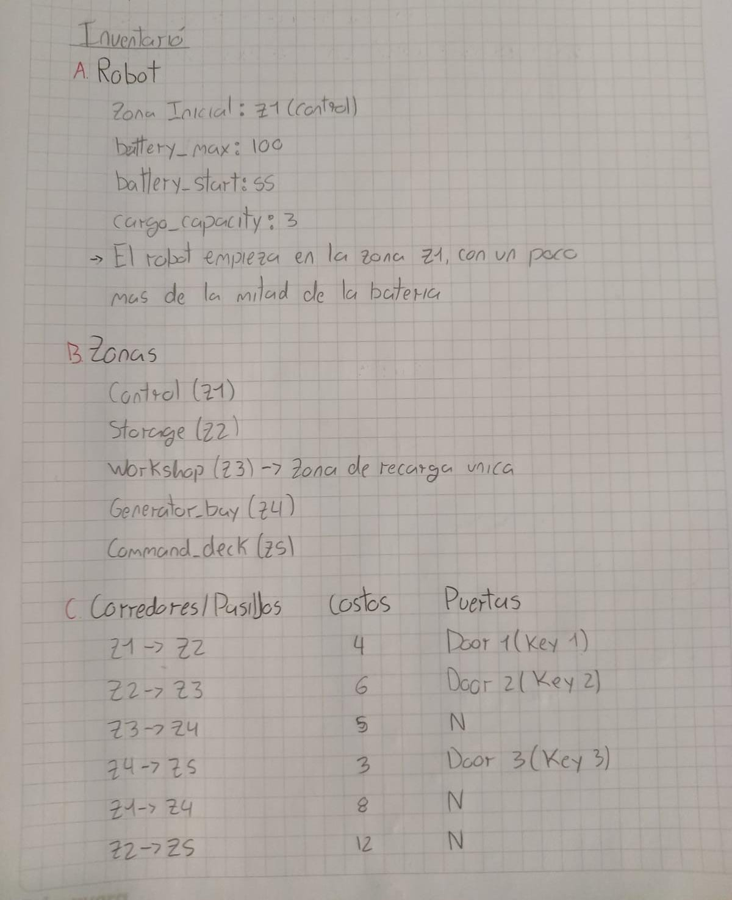
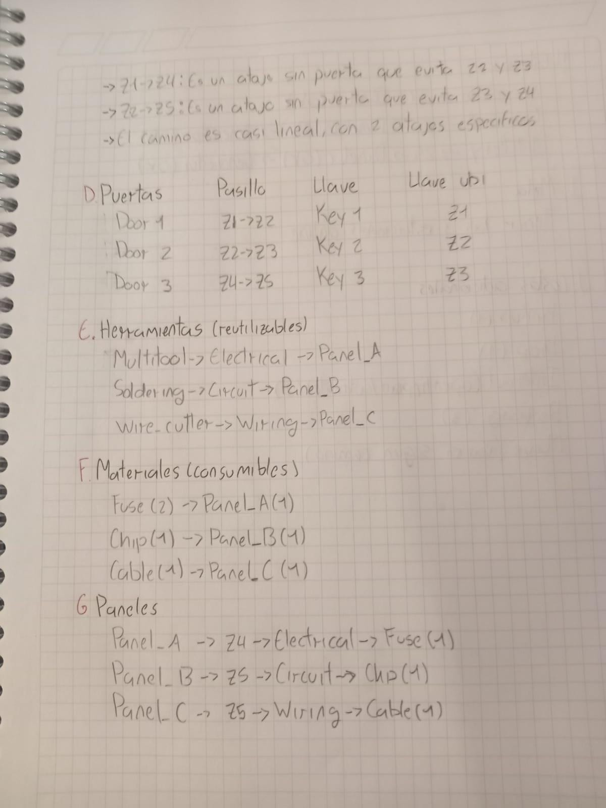
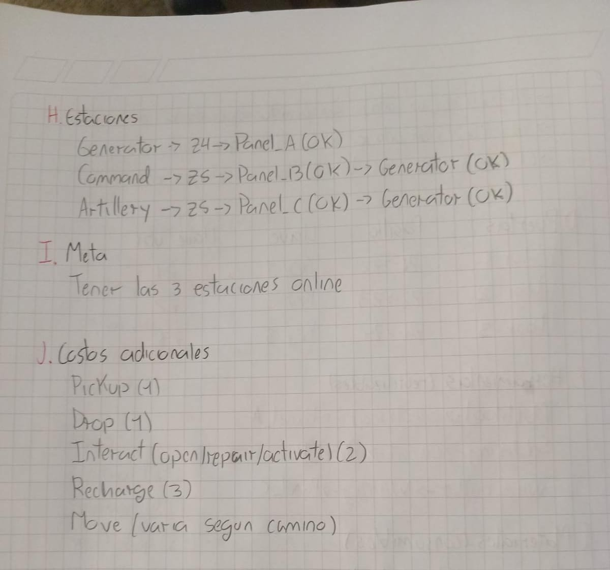

# Analisis de la instancia Emergency Control

PDST: Analisis Previo a documento de design.md, teniendo un inventario de que entidades existen dentro del problema







## 1. Robot

| Variable | Valor | Nota |
|---|---:|---|
| Zona inicial | `Z1` (`CONTROL`) | Punto de inicio del robot |
| `battery_max` | `100` | Capacidad maxima |
| `battery_start` | `55` | Bateria inicial ajustada para que la restriccion sea activa |
| `cargo_capacity` | `3` | Restrictivo: existen 9 objetos y nunca caben mas de 3 a la vez |

## 2. Zonas (5)

| Zona | Nombre | Recarga |
|---|---|---|
| `Z1` | `CONTROL` | No |
| `Z2` | `STORAGE` | No |
| `Z3` | `WORKSHOP` | **Si**, unico cargador |
| `Z4` | `GENERATOR_BAY` | No |
| `Z5` | `COMMAND_DECK` | No |

Solo hay **un** punto de recarga en todo el mapa: `Z3`. No es la zona inicial ni la zona final de la mision, lo que afecta directamente el presupuesto de bateria.

## 3. Grafo de corredores

El grafo es dirigido, aunque cada corredor tiene un costo simetrico en ambos sentidos.

```text
Z1 --4-- Z2 --6-- Z3 --5-- Z4 --3-- Z5
 \-----------8-----------/
        Z2 --12-- Z5
```

| Corredor | Costo | Puerta |
|---|---:|---|
| `Z1 <-> Z2` | 4 | `DOOR1` (`KEY1`) |
| `Z2 <-> Z3` | 6 | `DOOR2` (`KEY2`) |
| `Z3 <-> Z4` | 5 | Ninguna |
| `Z4 <-> Z5` | 3 | `DOOR3` (`KEY3`) |
| `Z1 <-> Z4` | 8 | Ninguna |
| `Z2 <-> Z5` | 12 | Ninguna |

### Notas de topologia

- `Z1 <-> Z4` es un atajo sin puerta que evita `Z2` y `Z3`: cuesta 8, frente a 15 por `Z1 -> Z2 -> Z3 -> Z4`.
- `Z2 <-> Z5` es un atajo directo y caro de costo 12, sin puerta, que salta `Z3` y `Z4`.
- Cada corredor con puerta tiene exactamente una puerta que lo bloquea.
- Los corredores `Z1-Z4`, `Z3-Z4` y `Z2-Z5` siempre estan disponibles.
- El grafo es casi un camino lineal, pero los dos atajos crean rutas alternativas reales. Esto es relevante para validar que UCS elija la ruta de menor costo.

## 4. Puertas y llaves

Las puertas y las llaves estan acopladas uno a uno.

| Puerta | Corredor | Llave | La llave esta en |
|---|---|---|---|
| `DOOR1` | `Z1 <-> Z2` | `KEY1` | `Z1` |
| `DOOR2` | `Z2 <-> Z3` | `KEY2` | `Z2` |
| `DOOR3` | `Z4 <-> Z5` | `KEY3` | `Z3` |

Cada llave esta antes de su propia puerta en el recorrido natural: recoger la llave permite abrir la puerta siguiente. Esta progresion no es obligatoria porque los atajos permiten rutas alternativas.

`KEY3` esta en `Z3`, pero abre `DOOR3`, ubicada entre `Z4` y `Z5`. Por tanto, debe transportarse desde `Z3` hasta `Z4` o `Z5`; ocupa espacio de carga durante ese tramo.

## 5. Herramientas

Las tres herramientas estan en `Z3` y son reutilizables.

| Herramienta | Tipo de dano que repara | Panel objetivo |
|---|---|---|
| `MULTITOOL` | `ELECTRICAL` | `PANEL_A` |
| `SOLDERING` | `CIRCUIT` | `PANEL_B` |
| `WIRE_CUTTER` | `WIRING` | `PANEL_C` |

En esta instancia cada herramienta sirve para un panel concreto. El modelo general debe permitir que una misma herramienta sirva para varios paneles.

## 6. Materiales

Los materiales son consumibles y se encuentran en `Z2`.

| Tipo | Cantidad disponible | Panel que lo consume |
|---|---:|---|
| `FUSE` | 2 | `PANEL_A`, requiere 1 |
| `CHIP` | 1 | `PANEL_B`, requiere 1 |
| `CABLE` | 1 | `PANEL_C`, requiere 1 |

Hay mas `FUSE` del necesario: hay 2 disponibles y solo 1 es requerido. Esto permite validar que el estado no distinga cual instancia concreta de `FUSE` fue transportada; debe usar cantidades o conteos canonicos por tipo.

## 7. Paneles

Hay tres paneles danados distribuidos en dos zonas.

| Panel | Zona | Dano | Herramienta requerida | Material requerido |
|---|---|---|---|---|
| `PANEL_A` | `Z4` | `ELECTRICAL` | `MULTITOOL` | `FUSE` |
| `PANEL_B` | `Z5` | `CIRCUIT` | `SOLDERING` | `CHIP` |
| `PANEL_C` | `Z5` | `WIRING` | `WIRE_CUTTER` | `CABLE` |

### Restriccion de capacidad

`PANEL_B` y `PANEL_C` estan en la misma zona, pero entre ambos requieren cuatro objetos: `SOLDERING`, `CHIP`, `WIRE_CUTTER` y `CABLE`. Como la capacidad es 3, no caben los cuatro objetos en un solo viaje a `Z5`.

Esto fuerza al menos un `DROP` y un `PICKUP` intermedio, ya sea en `Z3`, `Z4` o `Z5`, o requiere hacer dos viajes desde `Z3`.

## 8. Estaciones

Las estaciones tienen dependencias de activacion.

| Estacion | Zona | Paneles que deben estar reparados | Estaciones previas |
|---|---|---|---|
| `GENERATOR` | `Z4` | `PANEL_A` | Ninguna |
| `COMMAND` | `Z5` | `PANEL_B` | `GENERATOR` |
| `ARTILLERY` | `Z5` | `PANEL_C` | `GENERATOR` |

El orden parcial obligatorio es:

```text
GENERATOR -> COMMAND
GENERATOR -> ARTILLERY
```

`COMMAND` y `ARTILLERY` no dependen entre si, por lo que pueden activarse en cualquier orden una vez que `GENERATOR` este online.

## 9. Meta

```text
goal.stations_online = { GENERATOR, COMMAND, ARTILLERY }
```

La meta no impone condiciones sobre:

- La bateria final.
- La posicion final del robot.
- Los objetos que queden cargados.
- Los objetos que queden sueltos en las zonas.

## 10. Costos oficiales

| Accion | Costo |
|---|---:|
| `PICKUP` | 1 |
| `DROP` | 1 |
| `INTERACT` (`OPEN_DOOR`, `REPAIR`, `ACTIVATE`) | 2 |
| `RECHARGE` | 3 |
| `MOVE` | Segun corredor, entre 3 y 12 |

## 11. Presupuesto de bateria

Un plan razonable, aunque no necesariamente optimo, sigue la ruta:

```text
Z1 (KEY1) -> Z2 (KEY2 y materiales) -> Z3 (KEY3 y herramientas)
-> Z4 (PANEL_A) -> Z5 (PANEL_B y PANEL_C)
```

El costo minimo de movimiento visitando cada zona una vez en orden es:

```text
4 + 6 + 5 + 3 = 18
```

A esto hay que sumar el viaje extra que exige la capacidad de carga en `Z5`. Tambien se deben considerar:

- 3 aperturas de puertas.
- 3 reparaciones.
- 3 activaciones.
- 9 interacciones en total, con costo `9 x 2 = 18`.
- Al menos 9 `PICKUP`: 3 llaves, 3 herramientas y 3 materiales, con costo 9.
- Al menos 1 o 2 `DROP`, con costo 1 o 2.

El subtotal aproximado, sin contar el movimiento adicional por capacidad, es:

```text
18 + 18 + 9 + 2 = 47
```

El margen restante hasta la bateria inicial de 55 es reducido. El movimiento adicional forzado por la capacidad puede superar ese margen, por lo que `RECHARGE` en `Z3` se vuelve necesario o al menos muy conveniente en planes validos.

Esto confirma que la bateria es una restriccion activa en esta instancia y no un dato decorativo. Un diseño que ignore la bateria puede producir planes invalidos.

## 12. Resumen: una instancia minima pero completa

Esta instancia cubre los casos importantes del problema:

- Fuerza `DROP` real: capacidad 3 frente a 4 objetos simultaneos necesarios en `Z5`.
- Fuerza una decision de recarga con un presupuesto de bateria ajustado.
- Tiene una dependencia de activacion en cadena: `GENERATOR` debe activarse antes que las otras dos estaciones.
- Tiene rutas alternativas con costos distintos mediante los atajos `Z1-Z4` y `Z2-Z5`.
- Tiene objetos fungibles con holgura: 2 `FUSE`, pero solo 1 requerido.
- Tiene una llave que debe transportarse fuera de su zona natural de uso: `KEY3` se recoge en `Z3` y se utiliza para abrir `DOOR3` entre `Z4` y `Z5`.

Estas propiedades hacen que la instancia sea adecuada para probar representacion de estados, equivalencia, acciones aplicables, costos y busqueda de costo uniforme.
